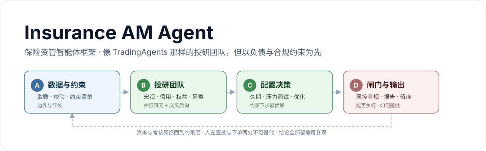
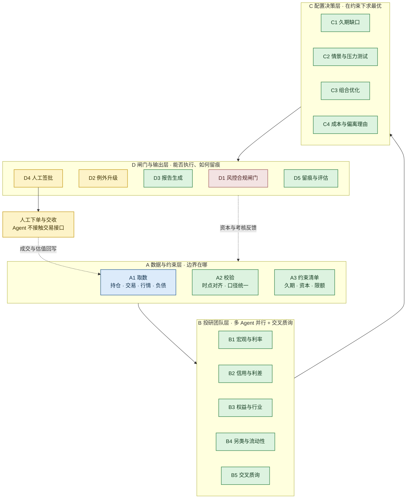
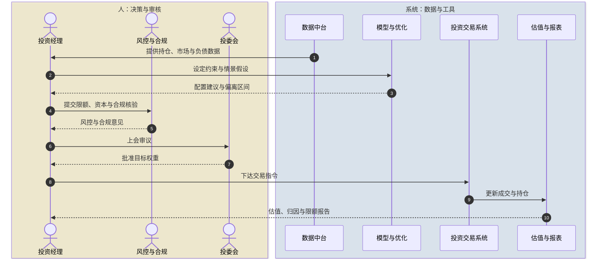
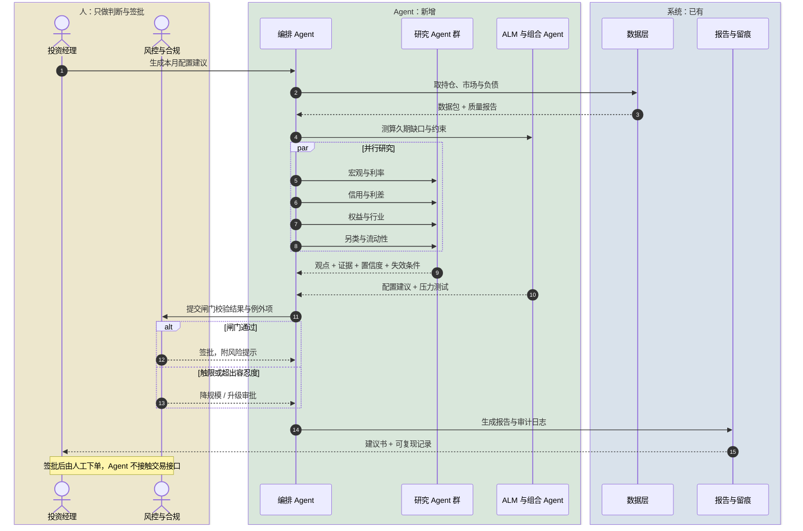

# Insurance AM Agent ｜保险资管智能体框架

[](LICENSE)
[](https://www.python.org/)
[](#快速开始)
[](https://github.com/Aayloo/insurance-am-agent/actions/workflows/tests.yml)
[](#路线图)
[](docs/)



> **一句话**：这是一个**面向保险资管的投研 Agent 框架**——结构上像 TradingAgents 那样由一组研究员 Agent 协作，但**起点不是行情，而是负债；终点不是交易单，而是带签批与留痕的决策建议。**

```
负债与监管约束  →  一组投研 Agent 并行研究  →  在约束下求解配置  →  风控合规闸门  →  人签批
```

---

## 60 秒看懂

| 你想知道 | 答案 |
| --- | --- |
| 这是什么 | 保险资管的投研 Agent 框架 + 可运行的零依赖 Demo |
| 像 TradingAgents 吗 | 骨架像（多角色、辩论、审批），约束不同（负债、监管、会计三道硬约束） |
| 做几个 Agent | 起步 2-3 个，标准 5-7 个，完整 8-10 个；拆不拆看"独立数据 / 方法 / 输出 / 责任人" |
| 能自动下单吗 | 不能，也不应该。下单与签批留给人 |
| 现在能跑吗 | 能。`python -m ins_am_agent`，8 个单元测试全绿 |

---

## 目录

- [这是不是"保险资管版的 TradingAgents"？](#这是不是保险资管版的-tradingagents)
- [架构：A / B / C / D 四层](#架构a--b--c--d-四层)
- [一次运行会发生什么：现状 vs 目标态](#一次运行会发生什么现状-vs-目标态)
- [图表总览](#图表总览)
- [文档导航](#文档导航)
- [快速开始](#快速开始)
- [示例输出](#示例输出)
- [仓库结构](#仓库结构)
- [设计原则](#设计原则)
- [路线图](#路线图)
- [参考项目](#参考项目)

---

## 这是不是"保险资管版的 TradingAgents"？

**是，但有三处根本不同。** 骨架相同（多角色协作、观点辩论、闸门审批），约束完全不同。

| 维度 | Trading Agent（GitHub 主流做法） | 本项目（保险资管） |
| --- | --- | --- |
| 决策起点 | 行情信号 | **负债**：久期、成本、退保与赔付假设 |
| 硬约束 | 资金与风控限额 | **监管比例 + 偿付能力资本 + 会计准则** |
| 决策频率 | 分钟到日 | **月到季**（SAA 3-5 年，TAA 月度） |
| 数据来源 | 公开行情 | 内部持仓、精算、财务（不出内网） |
| 最终输出 | 交易信号 / 下单 | **决策建议 + 报告**，永不自动下单 |
| 责任归属 | 个人账户自负盈亏 | 受托责任，**必须有人签批留痕** |
| 失效代价 | 亏钱 | 亏钱 + 监管处罚 + 问责 |

**它做什么**：把"取数 → 研究 → 配置 → 合规校验 → 出报告"这条链路自动化，让研究员与投资经理的时间花在判断上，而不是复制粘贴。

**它不做什么**：不选股荐股、不接交易接口、不做自动下单、不替代投委会。

---

## 架构：A / B / C / D 四层



### 为什么不是"一个万能 Agent"，也不是"十几个 Agent"

**拆分规则**：某环节同时满足 **独立数据、独立方法、独立输出、独立责任人** 四条，才值得拆成独立 Agent；四条不全则合并。

| 档位 | 组成 | 数量 | 适用阶段 |
| --- | --- | --- | --- |
| 起步档 | A 数据 + D 报告 | 2-3 | 第 1-2 个月 |
| 标准档 | A + B 投研团队 + D | 5-7 | 第 3-6 个月 |
| 完整档 | A + B + C + D + 评估 | 8-10 | 6 个月以后 |

> 单 Agent 的问题：上下文装不下、出错无法定位、无法单独验收。过多 Agent 的问题：协调成本高、口径漂移，而**口径不一致在保险场景比观点不新颖更致命**。

---

## 一次运行会发生什么：现状 vs 目标态

两张图对照看，差异只在一点：**中间环节由谁承担**。人始终保留签批与下单两处。

### 现状：投资经理串起全流程



### 目标态：Agent 承担中间环节，人只签批



**一句话**：现状是"人串起全流程"，目标态是"人只签批"。这也是判断 Agent 项目是否成功的标准——**中间环节被接管了多少，而人的两处责任没有被削弱**。

---

## 快速开始

**零第三方依赖**，Python 3.9+ 直接运行：

```bash
git clone https://github.com/Aayloo/insurance-am-agent.git
cd insurance-am-agent

# 跑一次完整流水线，生成报告与审计日志
python -m ins_am_agent --out examples/sample_report.md

# 跑测试
python -m unittest discover -s tests -v
```

可选：安装为命令行工具

```bash
pip install -e .
ins-am-agent --out examples/sample_report.md
```

> 内置的是**合成样例数据**（`data/sample_portfolio.json`），不含任何机构内部数据。替换为自己的数据文件即可接入真实流程：`python -m ins_am_agent --data your_portfolio.json`。

---

## 示例输出

运行后生成 [examples/sample_report.md](examples/sample_report.md)，结构如下：

| 章节 | 内容 | 由谁产出 |
| --- | --- | --- |
| 数据质量 | 时点对齐、缺失、口径告警 | A2 |
| 约束清单 | 久期目标、权益与另类上限、流动性下限 | A3 |
| 研究观点 | 结论、证据、置信度、**失效条件** | B1-B5 |
| 配置建议 | 目标权重、调整方向、偏离理由 | C1-C4 |
| 压力测试 | 利率上行、利差走阔、权益回撤影响 | C2 |
| 闸门结论 | 通过 / 降规模 / 升级审批 / 否决 | D1-D2 |
| 签批与留痕 | 待签批事项、运行版本、输入指纹 | D4-D5 |

---

## 图表总览

全部图表使用 Mermaid 编写，GitHub 直接渲染，可复制到任何支持 Mermaid 的编辑器修改。

| 图 | 类型 | 说明 | 位置 |
| --- | --- | --- | --- |
| A/B/C/D 四层架构 | 流程图 | 主架构与反馈闭环 | README 上方 · [03](docs/03-agent-architecture.md) |
| 投研团队协作 | 流程图 | 四个研究员并行 + 交叉质询 + 人工复核 | [03](docs/03-agent-architecture.md) |
| 演进路线 | 流程图 | 从 2 个 Agent 到 10 个的分阶段路径 | [03](docs/03-agent-architecture.md) |
| 业务四步闭环 | 流程图 | 定约束 → 定配置 → 做交易 → 控与报 | [01](docs/01-business-overview.md) |
| Agent 目标架构 | 流程图 | 系统在底、Agent 在中、人在顶 | [01](docs/01-business-overview.md) |
| 投资四道闸门 | 流程图 | 监管比例 · 内部授权 · 风险限额 · 会计披露 | [01](docs/01-business-overview.md) |
| 配置决策（现状） | 时序图 | 人主导，系统支撑 | [01](docs/01-business-overview.md) |
| 配置决策（目标态） | 时序图 | Agent 承担中间环节，人只签批 | [01](docs/01-business-overview.md) |
| 全景框架 | 流程图 | 治理 → 负债 → 资产 → 中后台 → 底座 | [02](docs/02-full-diagrams.md) |
| 投资价值链 | 流程图 | 含三个反馈闭环 | [02](docs/02-full-diagrams.md) |
| SAA / TAA 子流程 | 流程图 | 输入 → 方法 → 输出 → 验收 | [02](docs/02-full-diagrams.md) |
| 限额校验链 | 流程图 | 下单前六道闸门 | [02](docs/02-full-diagrams.md) |
| 季度 SAA + 月度 TAA | 时序图 | 八角色协作 | [02](docs/02-full-diagrams.md) |
| 单笔投资端到端 | 时序图 | 立项到存续期预警 | [02](docs/02-full-diagrams.md) |
| 月末估值归因报送 | 时序图 | 锁账到监管报送 | [02](docs/02-full-diagrams.md) |
| 投资生命周期 | 状态图 | 立项 → 存续 → 退出 | [02](docs/02-full-diagrams.md) |
| Agent 编排一次配置建议 | 时序图 | 含辩论循环与风控否决分支 | [02](docs/02-full-diagrams.md) |

---

## 文档导航

| 文档 | 内容 | 适合谁 |
| --- | --- | --- |
| [01 业务全景](docs/01-business-overview.md) | 五张图讲清保险资管怎么运转，人与系统如何分工 | 领导汇报、新同事入门 |
| [02 完整图集](docs/02-full-diagrams.md) | 十张图，含价值链、ALM、归因报送全流程 | 拆解 Agent 时查证 |
| [03 Agent 架构](docs/03-agent-architecture.md) | A/B/C/D 四层、做几个 Agent、优化建议 | 技术方案评审 |
| [04 落地路线](docs/04-roadmap.md) | 机会矩阵、数据契约、合规红线、分阶段路线 | 项目排期与立项 |

---

## 仓库结构

```text
insurance-am-agent/
├─ ins_am_agent/             # 零依赖的 Python 实现
│  ├─ agents/
│  │  ├─ a_data.py           # A1 取数 · A2 校验 · A3 约束清单
│  │  ├─ b_research.py       # B1-B5 研究员与交叉质询
│  │  ├─ c_allocation.py     # C1-C4 久期 · 压力测试 · 优化 · 偏离
│  │  ├─ d_gate.py           # D1-D2 风控合规闸门
│  │  └─ d_report.py         # D3 · D5 报告与审计留痕
│  ├─ orchestrator.py        # A → B → C → D 编排
│  ├─ models.py              # 数据结构定义
│  ├─ llm.py                 # 可选 LLM 接口（默认关闭，不影响运行）
│  └─ cli.py                 # 命令行入口
├─ data/sample_portfolio.json # 合成样例数据
├─ config/constraints.yaml    # 示例约束（示意值，非监管口径）
├─ docs/                      # 业务框架与架构文档（含主视觉图 assets/hero.svg）
├─ examples/                  # 示例输出与审计日志
└─ tests/                     # 单元测试
```

---

## 设计原则

1. **约束前置**：负债与监管约束在 A 层就变成结构化输入，而不是最后再检查。否则会做出一个很漂亮但根本不能投的组合。
2. **数字由代码算，语言由模型组织**：所有金额、比例、久期、收益率由确定性代码计算；LLM 只负责解释与写作。这是控制幻觉唯一可靠的方式。
3. **每个观点必须带失效条件**：研究员 Agent 要说明"什么情况下这个观点就不成立"。
4. **质询必须收敛**：辩论最多 N 轮，输出"分歧点清单"，而不是无限辩论。
5. **人不可替代的两处**：签批与下单。Agent 不接触交易接口，全部结论留痕可复现。

---

## 路线图

- [x] A 层：数据校验 + 约束清单生成
- [x] B 层：四类研究员 Agent + 交叉质询
- [x] C 层：久期缺口、压力测试、配置建议、换手成本
- [x] D 层：合规闸门、报告生成、审计留痕
- [x] 零依赖可运行 Demo 与单元测试
- [ ] 接入真实数据源适配器（行情、持仓、精算）
- [ ] 可选 LLM 增强：观点撰写与材料润色
- [ ] 回测框架：配置建议的历史回检与评分
- [ ] 评估体系：准确率、覆盖率、幻觉率、节省工时
- [ ] 中英文双语文档与案例集

---

## 参考项目

本项目在"多角色协作 + 观点质询 + 闸门审批"的骨架设计上，参考了以下开源工作；差异在于本项目把**负债与监管合规**作为第一性约束：

| 项目 | 借鉴点 |
| --- | --- |
| [TradingAgents](https://github.com/TauricResearch/TradingAgents) | 分析师团队 → 辩论 → 交易 → 风控审批的分层编排 |
| [ai-hedge-fund](https://github.com/virattt/ai-hedge-fund) | 角色化 Agent 与组合经理机制 |
| [FinRobot](https://github.com/AI4Finance-Foundation/FinRobot) | 分层金融 Agent 平台设计 |
| [Qlib](https://github.com/microsoft/qlib) / [RD-Agent](https://github.com/microsoft/RD-Agent) | 研究自动化闭环与可复现流水线 |
| [OpenBB](https://github.com/OpenBB-finance/OpenBB) | 统一数据接口层 |
| [ai-berkshire](https://github.com/xbtlin/ai-berkshire) | 中文语境的多 Agent 研究方法论 |

---

## 免责声明

- 本项目为**架构与工程演示**，其中所有数值（监管比例、限额、收益率）均为**示意值**，不构成任何监管口径或投资建议。
- 仓库内**不含任何机构内部数据**；样例数据为程序生成的合成数据。
- 使用者需自行确保符合所在司法辖区的监管要求与内部合规制度。

## License

[MIT](LICENSE) © 2026 Aayloo
