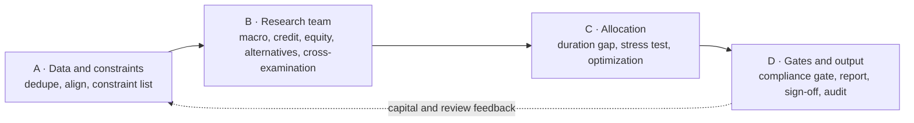

# Insurance AM Agent

> **In one line**: a multi-agent research framework for **insurance asset management** — structured like TradingAgents, but it starts from **liabilities** instead of prices, and ends with a **signed decision memo** instead of a trade order.

[中文文档](README.md) ｜ [License: MIT](LICENSE)

## Is it "TradingAgents for insurance asset management"?

Yes in skeleton, no in constraints.

| Dimension | Typical trading agents | This project |
| --- | --- | --- |
| Starting point | Price signals | **Liabilities**: duration, cost of guarantees, lapse and claim assumptions |
| Hard constraints | Capital and risk limits | **Regulatory ratios + solvency capital + accounting rules** |
| Decision frequency | Minutes to days | **Months to quarters** (SAA 3-5y, TAA monthly) |
| Data | Public market data | Internal holdings, actuarial and finance data (stays on-premise) |
| Output | Trade signal / order | **Decision memo with sign-off and audit trail** |
| Accountability | Personal P&L | **Fiduciary duty, a human must sign** |

## Architecture: four layers



## Quick start

No third-party dependencies, Python 3.9+:

```bash
python -m ins_am_agent --out examples/sample_report.md
python -m unittest discover -s tests -v
```

All sample data is synthetic. Nothing from any institution is included.

## Design principles

1. **Constraints first** — liability and regulatory limits are structured inputs, not a final check.
2. **Numbers by code, language by model** — all figures are computed deterministically; an LLM may only explain and write.
3. **Every view carries an invalidation condition.**
4. **Debate must converge** — output is a list of open disagreements, not endless argument.
5. **Two human-only steps**: sign-off and order execution.

## Disclaimer

Architecture and engineering demo only. All regulatory ratios and limits shown are illustrative, not regulatory guidance, and not investment advice. MIT licensed.
