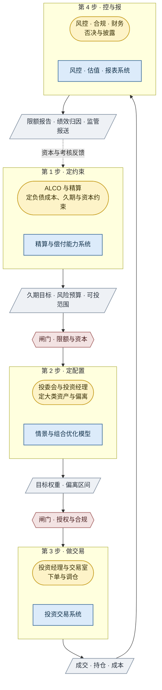
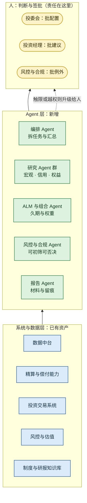
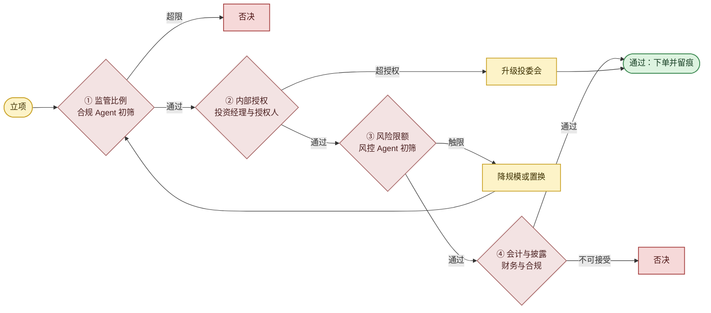
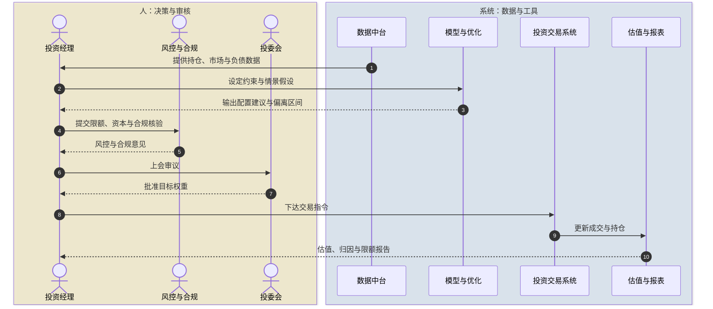
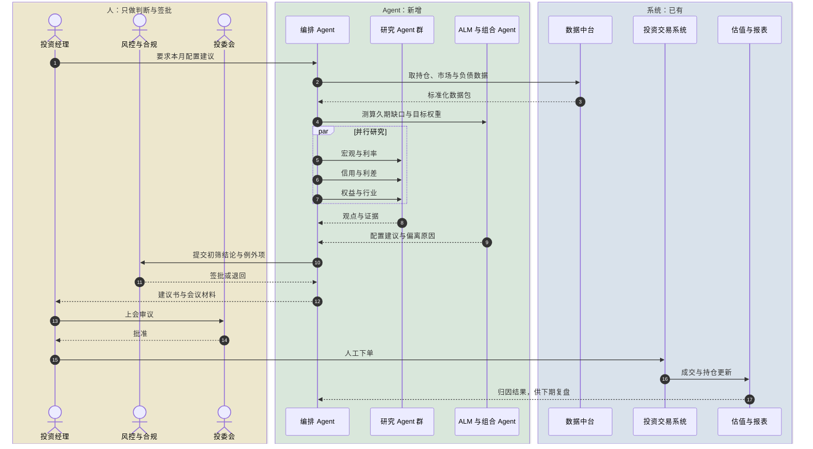

# 保险资管框架 · 精简版（一页看懂）

> **用途**：给领导与流程内的人一眼看清「谁做、用什么系统、Agent 将来接哪一段」。
> **读图约定**：**圆角＋小人＝人**；**方块＝系统**；**菱形＝闸门**；**绿色＝Agent**。全部图可直接在 GitHub、VS Code、语雀、mermaid.live 渲染。

---

## 图例

| 视觉 | 含义 | 颜色 | 谁负责 |
| --- | --- | --- | --- |
| 圆角框 / 小人 | 人：决策与执行角色 | 暖黄 | 人，需签批与担责 |
| 直角框 | 系统：已有工具与数据 | 浅蓝 | 系统，自动运行 |
| 菱形 | 闸门：通过 / 降规模 / 升级 / 否决 | 灰 | 人与 Agent 均可初筛 |
| 绿色框 | Agent：AI 可承担的环节 | 浅绿 | 人审后采用 |

---

## 图 1：一页全景 —— 保险资管四步闭环

每一步都是「人在判断 + 系统在支撑」，产出交由下一步。

**一句话**：定约束 → 定配置 → 做交易 → 控与报，然后回到约束。

---

## 图 2：Agent 目标架构 —— 人只做判断与签批

三层：系统在底、Agent 在中、人在顶。

**保险 Agent 的两块专属增量**：`ALM 与组合 Agent`（把久期与负债成本带进决策）、`风控与合规 Agent`（把监管比例与关联交易变成硬闸门）。通用投资 Agent 都没有这两块。

---

## 图 3：一笔投资的四道闸门

---

## 时序图 1：现在的配置决策（人和系统分工）

**小人＝人，方块＝系统**。

---

## 时序图 2：Agent 接入后的目标态（人只签批）

与上一张对比即可看出：**Agent 承担中间环节，人在三处签批**。

---

## 现状 → Agent：谁做这一段的对照表

| 环节 | 现在谁做 | Agent 后 | 人保留什么 |
| --- | --- | --- | --- |
| 取数与校验 | 人工拼数 | 数据 Agent 自动完成 | 抽查口径 |
| 研究观点 | 研究员各自完成 | 研究 Agent 群并行 | 采纳与否 |
| 久期与配置测算 | 人工与模型混合 | ALM 与组合 Agent | 定约束与拍板 |
| 限额与合规核验 | 人工逐条核对 | 风控与合规 Agent 初筛 | 批例外 |
| 报告与材料 | 手工拼接 | 报告 Agent 生成初稿 | 复核签发 |
| 下单与交收 | 投资经理与交易室 | 不变，人工执行 | 全程人工 |
| 投资决议 | 投委会 | 不变 | 全程人工 |

**两条底线**：Agent 不接触下单接口；所有结论必须有人签批，且全程留痕。

---

> 详细图集（价值链、SAA/TAA 子流程、四类时序图与状态图）：[02-full-diagrams.md](02-full-diagrams.md)
> Agent 怎么搭、做几个、A/B/C/D 四层怎么分：[03-agent-architecture.md](03-agent-architecture.md)
> Agent 化机会矩阵、数据契约、合规红线与落地路线：[04-roadmap.md](04-roadmap.md)
> 可运行代码与示例输出：[返回项目首页](../README.md)
