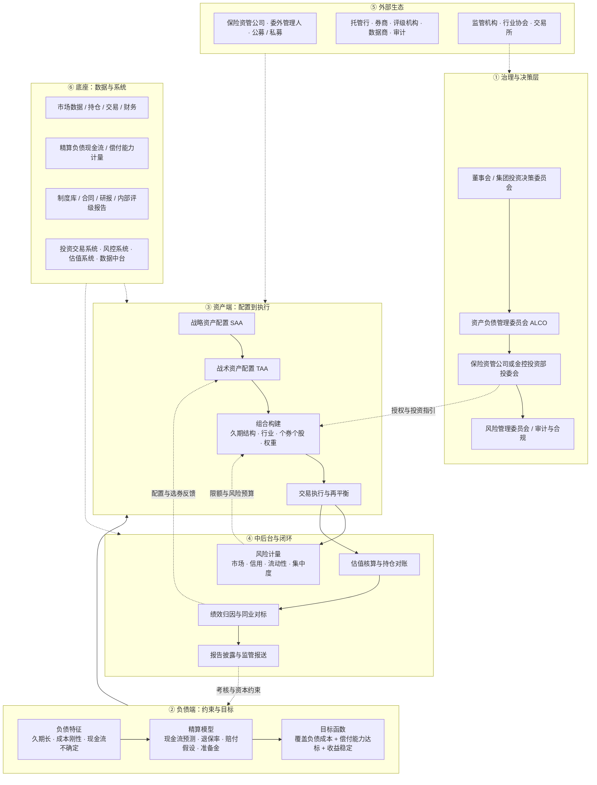
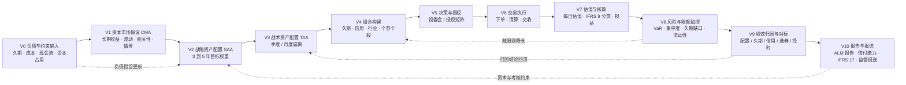
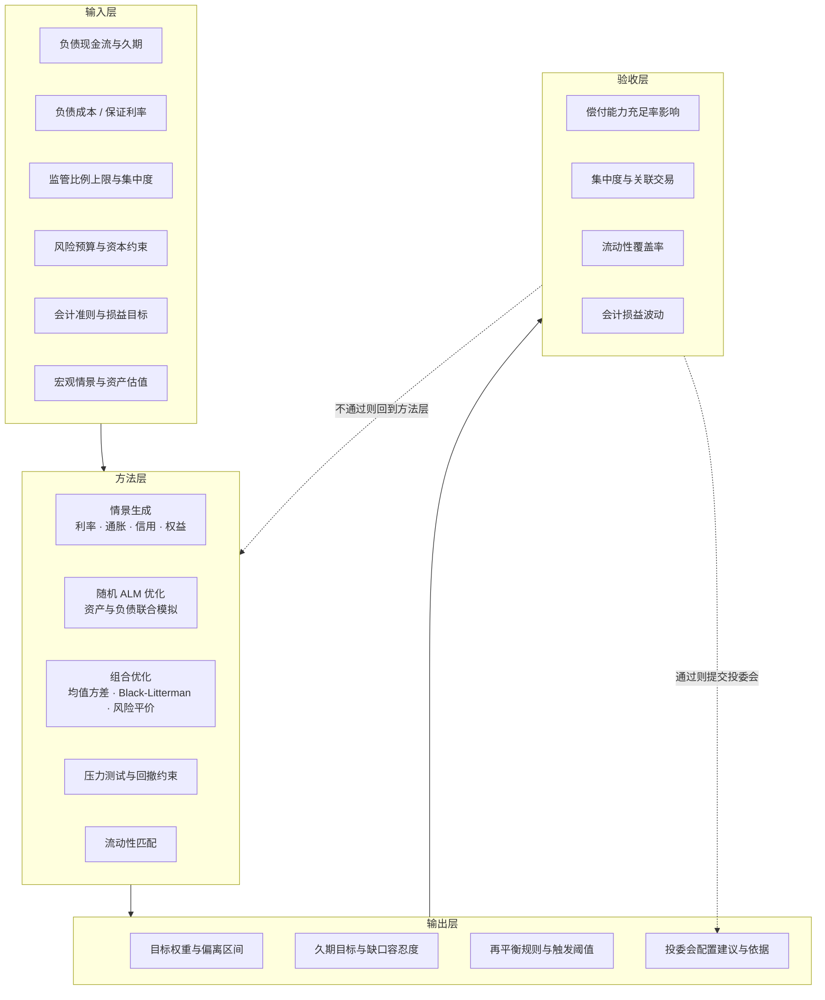
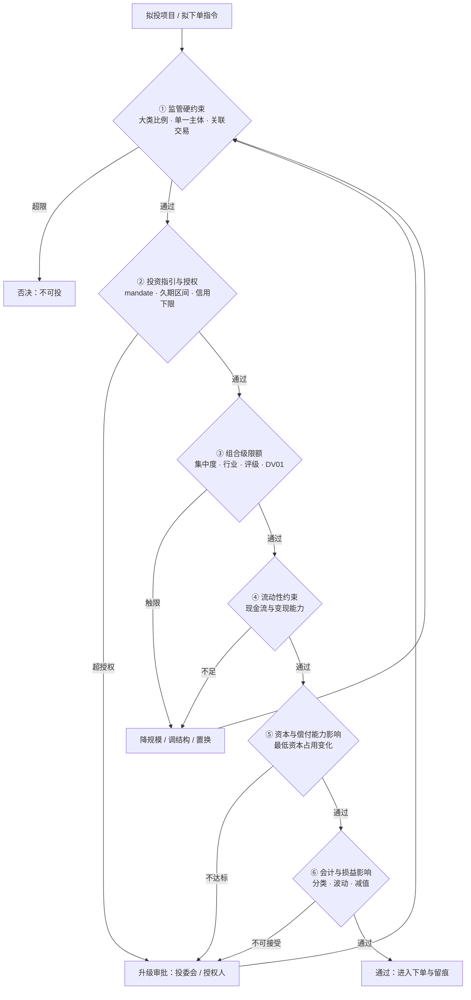
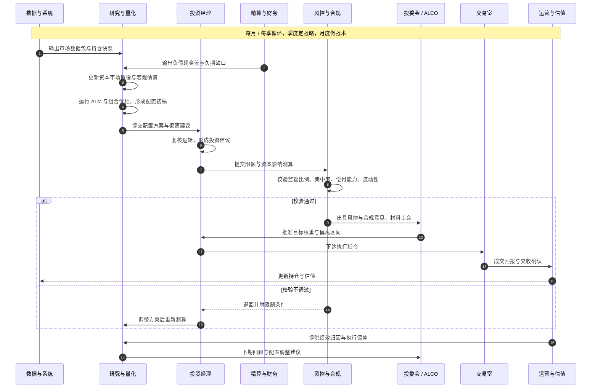
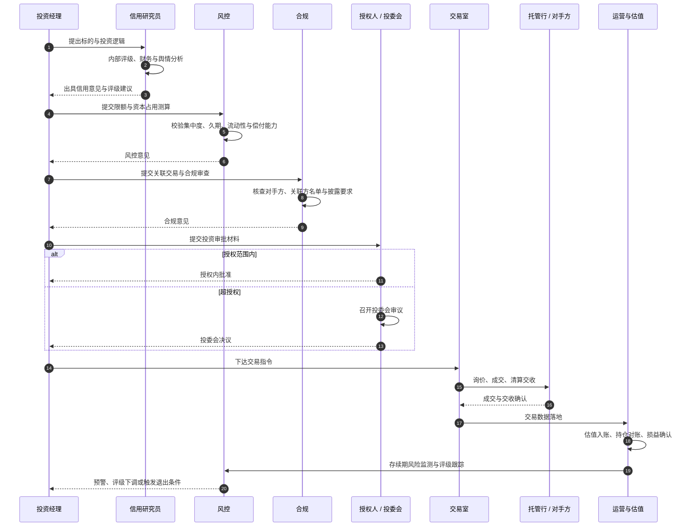
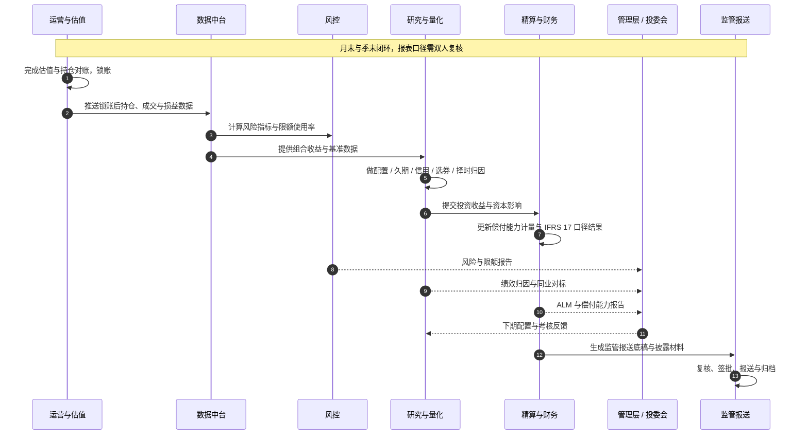
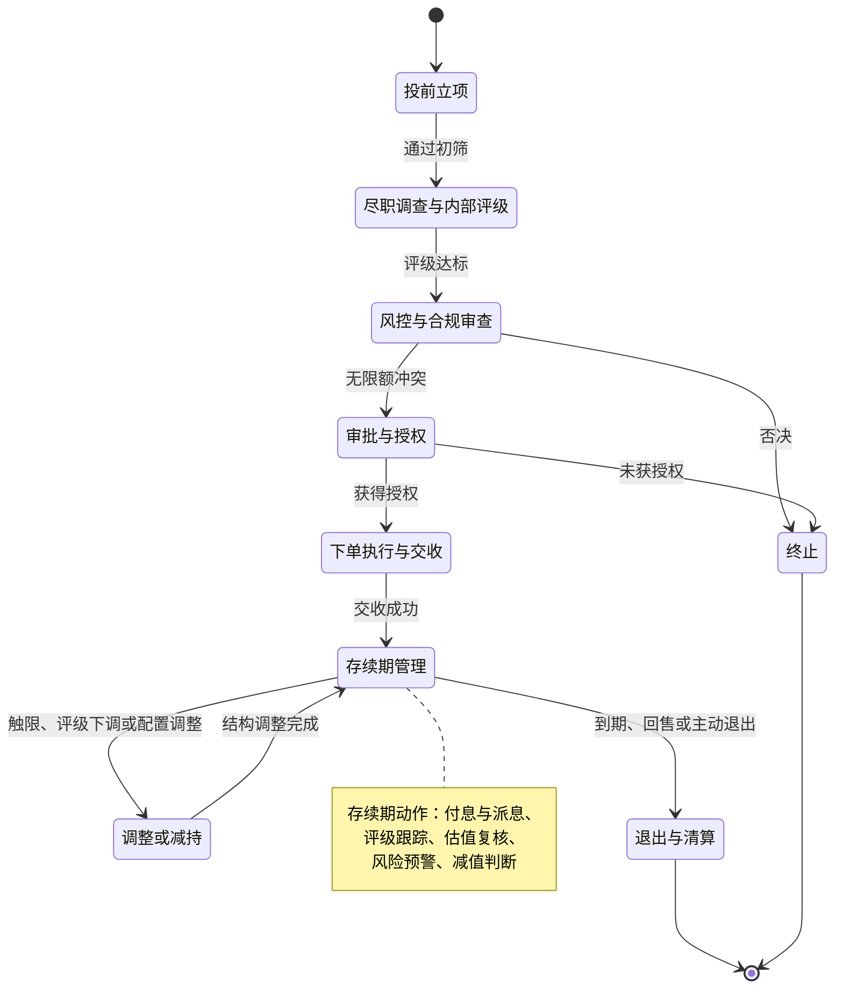
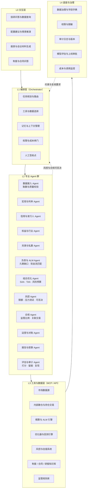
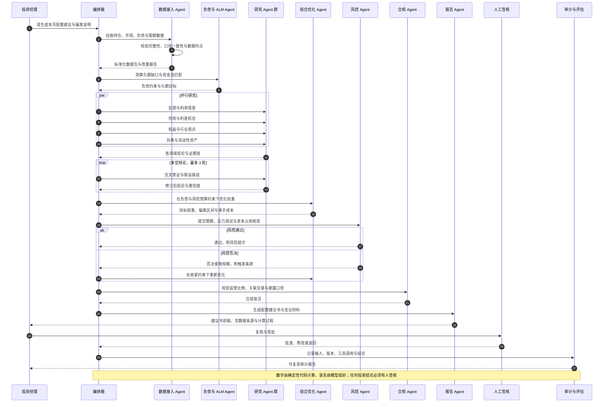

# 保险资管框架 · 详细版（参考）

> **用途**：作为「保险行业 Agent」的领域底图（domain map）。先把业务画清楚，再把每个环节映射成 Agent。
> **对外汇报建议使用 [01-business-overview.md](01-business-overview.md)**；本文件保留完整图集，供拆解 Agent 时查证。
> **口径**：融合中国大陆险资实践（金融监管总局口径、偿二代二期、IFRS 17 / IFRS 9）与香港实践（HKIO 风险为本资本、SFC 第 9 类牌照）。图中的监管数值均为**示意**，落地前须按最新监管文件与公司内部制度校准。
> **渲染**：全部图为 Mermaid 语法，可直接在 GitHub、VS Code、Typora、Obsidian、语雀或 mermaid.live 中渲染。

---

## 0. 一句话主线

**保险资管 = 在三重约束下，把保费与准备金投出去，并在「收益 / 久期匹配 / 偿付能力 / 流动性」之间做权衡。**

三重约束：

| 约束 | 来源 | 对投资的直接含义 |
| --- | --- | --- |
| 负债约束 | 精算：久期、成本刚性、退保与赔付不确定 | 必须做 ALM，久期缺口与再投资风险是硬指标 |
| 监管约束 | 监管比例上限、集中度、偿付能力、关联交易 | 决定了「能投多少、能投什么」，是配置的可行域 |
| 会计约束 | IFRS 17（保险合同）/ IFRS 9（金融工具）分类 | 决定损益波动落在哪张表，直接影响权益与高股息策略偏好 |

五层结构：**治理决策层 → 负债约束层 → 资产配置层 → 中后台闭环层 → 数据与系统底座**。

---

## 1. 图 1：保险资管全景框架图

**如何读这张图**：左边（治理 + 负债）决定「目标与可行域」，中间（资产端）是真正的投资动作，右边（中后台）是把结果算清、报准、反馈回配置。绝大多数 Agent 项目的失败原因，是只做了中间一层，缺了负债与合规这两端。

---

## 2. 图 2：投资价值链主流程（含闭环）

**闭环的三个回馈点**：

1. **风险 → 组合**：触限、久期缺口扩大、流动性不足时，直接约束组合构建。
2. **归因 → TAA**：如果收益主要来自 beta 而非选券，说明应回到配置层决策。
3. **报告 → SAA**：偿付能力与会计结果反过来改写下一轮的风险预算与目标权重。

---

## 3. 图 3：SAA / TAA 配置决策子流程

---

## 4. 表 1：大类资产地图（保险视角）

| 资产类别 | 典型工具 | 在保险组合中的角色 | 关键风险 | 监管 / 资本 / 会计要点 |
| --- | --- | --- | --- | --- |
| 利率债与存款 | 国债、政金债、协议存款、大额存单 | 久期匹配的压舱石，稳定票息 | 利率风险、再投资风险 | 资本占用低；多计入 AC / FVOCI |
| 信用债与非标 | 信用债、债权投资计划、ABS | 票息增强，拉长久期 | 信用与流动性风险 | 需内部评级；非标集中度受限 |
| 权益 | 蓝筹、高股息、长期股权投资、举牌 | 收益弹性与抗通胀 | 波动与减值 | 权益类比例上限与偿付能力挂钩；高股息常走 FVOCI 以平滑损益 |
| 基金与委外 | 公募、私募、MOM / FOF | 能力外延，快速调仓 | 管理人风险、风格漂移 | 需委外准入与业绩评价机制 |
| 另类 | 不动产、基础设施、股权、REITs | 长期现金流，匹配长久期负债 | 估值不透明、退出难 | 比例与集中度受限；需穿透与估值审查 |
| 海外资产 | QDII、港股通、境外债 | 分散与币种配置 | 汇率与政策风险 | 额度管理、汇率对冲要求 |
| 衍生品 | 利率互换、国债期货、期权 | 对冲而非投机 | 基差与操作风险 | 严格限于套期保值，需授权与留痕 |
| 流动性资产 | 货币基金、活期与短期存款 | 应对赔付与退保高峰 | 机会成本 | 流动性覆盖率要求 |

---

## 5. 图 4：限额与合规校验链（下单前的层层闸门）

---

## 6. 时序图 A：季度 SAA + 月度 TAA 决策

---

## 7. 时序图 B：单笔固收 / 非标投资端到端

---

## 8. 时序图 C：月末估值—归因—报告—报送闭环

---

## 9. 状态图：一笔投资的存续生命周期

---

## 10. 图 5：保险行业 Agent 目标架构

**保险行业相比通用投资 Agent 的两个关键增量**：`负债与 ALM Agent`（把久期、成本、退保假设带进决策）与 `合规 Agent`（把监管比例、关联交易、披露口径变成硬闸门）。通用开源项目基本都没有这两块，这正是保险 Agent 的差异化所在。

---

## 11. 时序图 D：Agent 编排一次「本月配置建议」

---

## 12. 附录：与开源投资 Agent 的对应关系

| 参考项目 | 热度（星标，2026-09） | 可借鉴的机制 | 对应本框架环节 |
| --- | --- | --- | --- |
| TradingAgents（TauricResearch） | 约 10.5 万 | 分析师团队 → 多空辩论 → 交易 → 风控审批的分层编排 | 图 5 的 L1 / L2，时序图 D 的辩论循环 |
| ai-hedge-fund（virattt） | 约 6.3 万 | 角色化人格 Agent + 风控 + 组合经理，可回测原型 | 研究 Agent 群与组合优化 Agent |
| FinRobot（AI4Finance） | 约 8 千 | 分层金融 Agent 平台，工具与模型解耦 | 图 5 的 L2 / L3 分层 |
| Qlib + RD-Agent（微软） | 约 4.9 万 / 1.5 万 | 研究自动化循环：假设 → 实现 → 回测 → 反思 | 研究流水线、因子与模型治理 |
| OpenBB | 约 7.3 万 | 统一数据接口层，供 Agent 调用 | 图 5 的 L3 工具层 |
| ai-berkshire（中文，Codex / Claude Code） | 约 1.6 万 | 多大师方法论 + 并行研究，基于 Skill 与 MCP 落地 | 中文语境的研究 Agent 编排 |
| Vibe-Trading（HKUDS） | 约 3.3 万 | MCP 工具化 + 多 Agent + 回测闭环 | 工具层与回测治理 |
| FinGPT | 约 2.1 万 | 金融文本模型与情绪因子管道 | 信用舆情与另类数据 Agent |
| QuantsPlaybook | 约 6 千 | 中文券商金工研报复现知识库 | 知识库与策略素材 |
| ALM / 偿付能力类小众项目（Stochastic-ALM-Model、ALMSystem-PublicDemo） | 个位数到数十 | 随机 ALM、IFRS 17 + Solvency II 现金流预测 | 负债与 ALM Agent（保险专有） |

> 说明：截至 2026-09，开源生态在「投资 / 交易 / 研究」侧非常丰富，但**保险资管专属的 Agent 项目几乎空白**（保险侧多为核保、理赔、合同问答等小项目）。因此合理路线是：**用投资 Agent 的骨架，补上负债与监管合规两层**。

---

## 13. 使用与维护建议

1. **作图与改图**：直接在 mermaid.live 粘贴单张图代码即可编辑；公司内部文档建议用 VS Code 或语雀预览。
2. **口径校准**：表 1 与图 4 的监管比例必须替换为公司内部制度与最新监管文件的实际数值，并标注生效日期。
3. **与 Agent 的衔接**：每个图节点都应能回答三个问题——输入是什么、输出是什么、谁负责签核。不能回答的节点，暂时不适合 Agent 化。
4. **落地顺序**：先做数据接入与报告（低风险），再做研究与配置建议（中风险），交易执行永远保留人工。

> 配套文件：`保险资管Agent_映射与路线图.md`（环节 × Agent 化机会矩阵、数据契约、合规红线、分阶段路线图）。
