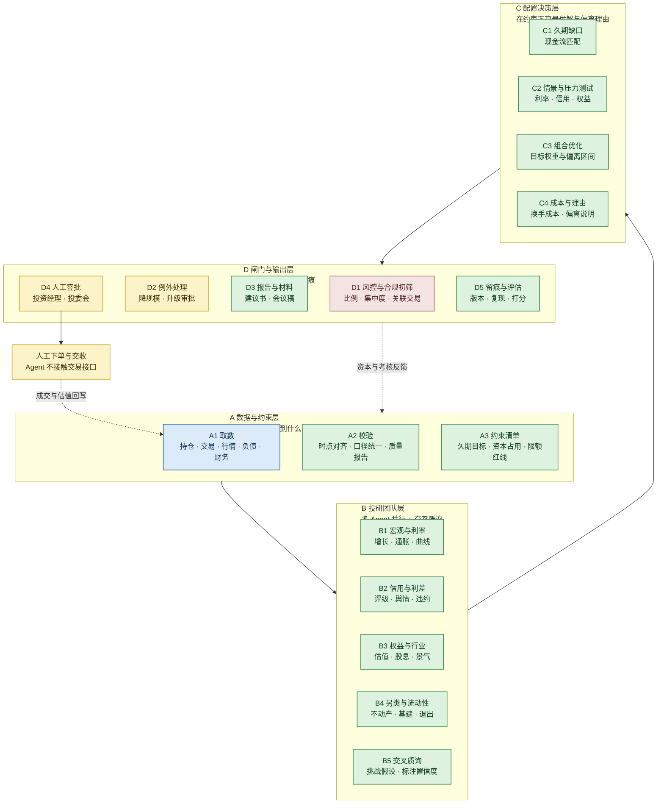
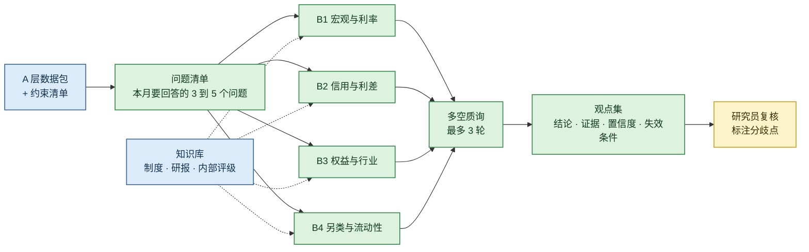

# 保险资管 Agent 搭建方案（A / B / C / D 四层）

> **回答两个问题**：能不能做成"一组投研人员的 Agent"？——能，但不能照抄 trading agent。
> **做几个 Agent**？——不是 1 个，也不是 20 个。推荐 **1 个编排 + 4 个专业层（A B C D）+ 投研内部 4 个研究员**。
> **配套文件**：[01-business-overview.md](01-business-overview.md)（业务全景）、[04-roadmap.md](04-roadmap.md)（落地路线）。
> **可运行实现**：本仓库 `ins_am_agent/` 目录已按 A/B/C/D 四层给出零依赖的参考实现（`python -m ins_am_agent`）。

---

## 一、先回答：能，但和 trading agent 有三处根本不同

| 维度 | Trading Agent（GitHub 主流做法） | 保险资管 Agent |
| --- | --- | --- |
| 起点 | 行情信号 | **负债**：久期、成本、退保与赔付假设 |
| 约束 | 资金与风控限额 | **监管比例 + 偿付能力资本 + 会计准则**三道硬约束 |
| 决策频率 | 分钟到日 | **月到季**（SAA 三到五年，TAA 月度） |
| 数据 | 公开行情为主 | 内部持仓、精算、财务为主（不能出内网） |
| 输出 | 交易信号 / 下单 | **决策建议 + 报告**，永远不自动下单 |
| 责任 | 个人账户，自负盈亏 | 受托责任，必须有人签批留痕 |
| 团队结构 | 分析师辩论很热闹 | 辩论必须收敛到"满足负债与监管的可行解" |
| 失效代价 | 亏钱 | 亏钱 + 监管处罚 + 问责 |

**结论**：可以借用 trading agent 的"多角色协作"骨架，但必须把最上面一层换成**负债与合规**。照抄的结果会得到一个很会讲故事的选股机器人，而不是保险资管能用的东西。

---

## 二、做一个 Agent 还是多个？判断规则

**只有一个规则**：某个环节同时满足以下四条，才值得拆成一个独立 Agent。

1. **独立数据**：用别人不用的数据。
2. **独立方法**：有自己的模型或方法论。
3. **独立输出**：产出可以被单独验收的东西。
4. **独立责任人**：出错时知道该问谁。

四条不全 → 合并进上一个 Agent，不要拆。

为什么不做"一个万能 Agent"：上下文塞不下全部数据；出错时无法定位是哪一步；无法单独验收；改一个地方会牵连全部。

为什么不做"十几个 Agent"：协调成本与调用成本会压过收益；口径会在多个 Agent 之间漂移；在保险场景里，口径不一致比观点不新颖更致命。

---

## 三、A / B / C / D 四层主架构

**每一步的实际动作（可以直接拿去做需求文档）**：

| 步骤 | 谁来做 | 具体动作 | 产出 |
| --- | --- | --- | --- |
| A1 | 系统 | 拉取持仓、成交、行情曲线、精算负债、财务科目 | 原始数据包 |
| A2 | 数据 Agent | 时点对齐、口径映射、缺失与异常检查 | 可用数据包 + 质量报告 |
| A3 | 数据 Agent | 把久期目标、资本约束、限额红线转成结构化约束 | 约束清单 |
| B1 | 宏观 Agent | 生成增长、通胀、利率路径情景 | 情景假设卡 |
| B2 | 信用 Agent | 评级迁移、利差机会、违约预警 | 信用观点与预警 |
| B3 | 权益 Agent | 估值、股息率、行业景气 | 权益观点 |
| B4 | 另类 Agent | 不动产与基建现金流、退出难度 | 另类观点 |
| B5 | 质询 Agent | 多空对立、挑战假设、标注置信度与失效条件 | 收敛后的观点集 |
| C1 | 配置 Agent | 测算久期缺口与现金流匹配度 | 久期方案 |
| C2 | 配置 Agent | 跑利率、信用、权益三类情景与压力测试 | 压力测试结果 |
| C3 | 配置 Agent | 在约束下求解目标权重与偏离区间 | 配置建议 |
| C4 | 配置 Agent | 估算换手成本，写出偏离理由 | 建议书主体 |
| D1 | 风控合规 Agent | 逐条校验监管比例、集中度、关联交易 | 通过 / 降规模 / 升级 / 否决 |
| D2 | 人 | 处理例外与超授权事项 | 审批意见 |
| D3 | 报告 Agent | 生成建议书与投委会材料 | 材料初稿 |
| D4 | 人 | 签批，承担决策责任 | 批准或退回 |
| D5 | 评估 Agent | 记录版本、工具调用、结论，事后回检 | 审计与评分报告 |

---

## 四、B 层内部：一组投研 Agent 怎么协作

这是与 trading agent 最像的一层，关键是**并行研究 + 交叉质询 + 置信度分级**，而不是把观点简单相加。

**三个设计要点**：

1. **每个研究员必须交"失效条件"**：什么情况下这个观点就不成立。这是防止 Agent 讲空话最有效的约束。
2. **质询必须收敛**：最多 3 轮，输出的是"分歧点清单"而不是继续辩论。
3. **人只标注分歧、不重写观点**：研究员的时间花在判断上，而不是在复制粘贴上。

---

## 五、Agent 数量：分三档，别一步到位

| 档位 | 组成 | Agent 数量 | 适用阶段 | 能解决什么 |
| --- | --- | --- | --- | --- |
| 起步档 | A 数据 + D 报告 | 2 到 3 个 | 第 1 到 2 个月 | 取数自动化、月报自动化 |
| 标准档 | A + B + D | 5 到 7 个 | 第 3 到 6 个月 | 投研观点自动化、带证据链 |
| 完整档 | A + B + C + D + 评估 | 8 到 10 个 | 6 个月以后 | 配置建议闭环、可上会 |

**演进路线**：

**顺序不能颠倒**：A 没做扎实，B 的观点就没有可靠输入；C 没有 A 的约束清单，优化结果无法上会；D 的闸门必须在 C 之后才谈，否则会以为 Agent 可以直接给结论。

---

## 六、优化建议：这五件事决定成败

| 优化点 | 做法 | 不这样做会怎样 |
| --- | --- | --- |
| 数字与语言分离 | 值一律由代码算，模型只解释 | 出现编造的收益率与久期 |
| 约束前置 | 把监管与负债约束写进 A 层，不放在最后检查 | 做出一个漂亮的、但不可投的组合 |
| 可解释优先 | 每个结论附证据、置信度、失效条件 | 领导和风控不会用 |
| 评估前置 | 第一期就定义准确率、覆盖率、节省工时 | 半年后无法证明价值 |
| 权限最小化 | 只读为主，写操作集中到报告与留痕 | 一旦出错影响面不可控 |

**不要做的三件事**：不要接交易接口；不要让 Agent 直接给"买/卖"结论而不给推导；不要把内部数据放进任何外部模型或公开仓库。

---

## 七、一句话总结

**保险资管的 Agent 不是"一组会炒股的 AI"，而是"一组会做研究的 AI + 一套把负债和监管当硬约束的闸门"。** 推荐从 A 档起步，标准档落地成 1 个编排 + 4 个投研 + 风控合规 + 报告，人在签批与下单两个位置不可替代。
