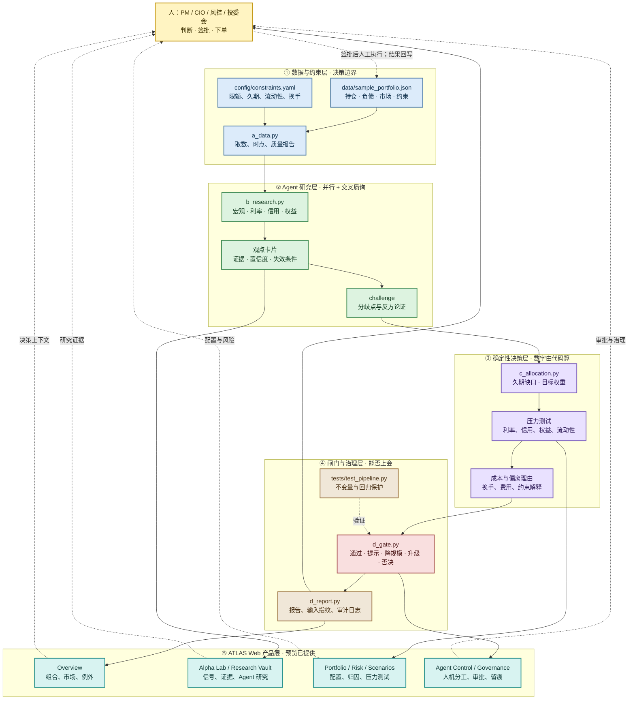

# Platform Product Map｜从保险资管 Agent 引擎到 ATLAS Web 工作台

> 这份文档是项目的“总地图”：先解释系统做什么，再说明每个目录如何参与，最后说明未来网页平台会让投资团队看到什么。

## 1. 项目到底在做什么

`insurance-am-agent` 不是一个自动交易机器人，也不是只有聊天框的通用 AI。它是一条面向保险资管的**决策支持流水线**：

```text
负债与监管约束
        ↓
数据取数与质量校验
        ↓
宏观 / 信用 / 权益 / 另类研究 Agent 并行工作
        ↓
久期、压力测试、组合配置与成本测算
        ↓
风控合规闸门
        ↓
投资建议书 + 审计日志 + 人工签批
```

系统的价值不是替 PM 下单，而是把中间最耗时、最容易口径漂移、最难留痕的工作变成可复现流程。投资经理、风险负责人和投委会仍然保留最终判断、签批与交易执行责任。

## 2. 当前实现与平台预览的边界

| 能力 | 当前仓库 | ATLAS Web 预览 | 后续接入真实系统 |
| --- | --- | --- | --- |
| A 层数据取数、质量、负债与约束 | 已实现，使用 JSON/YAML 样例 | Overview / Data Quality | 接数仓、估值、精算与偿付能力系统 |
| B 层宏观、信用、权益、另类研究 | 已实现确定性样例 Agent | Alpha Lab / Research Vault / Agent Control | 接私有知识库、外部研究与 LLM |
| C 层久期、压力、配置、成本 | 已实现规则与计算 Demo | Portfolio Studio / Scenario Studio | 接真实 ALM、优化器与风险模型 |
| D 层闸门、报告、审计 | 已实现报告与审计 JSON | Risk / Execution / Governance | 接审批、权限与监管报送工作流 |
| 多 Agent 编排 | 已实现 A→B→C→D 编排器 | Agent Control | 接任务队列、模型路由、观测与重试 |
| 完整 Web 前端 | 尚未接入 | **产品级交互预览** | React/Next.js 或内部前端应用 |
| 自动交易执行 | 明确不做 | 仅展示人工执行边界 | 仍不由 Agent 直接下单 |

## 3. 全项目彩色逻辑图



### 读图方式

1. **蓝色**是数据和约束：告诉系统“现在是什么、能投什么、不能超过什么”。
2. **绿色**是 Agent：负责检索、研究、挑战和解释，不直接改数字。
3. **紫色**是确定性决策计算：久期、权重、压力和成本由代码计算。
4. **红色**是闸门：决定通过、降规模、升级还是否决。
5. **棕色**是证据和审计：让每个数字、模型版本和签批动作可追溯。
6. **青色**是最终 Web 产品：把同一条流水线呈现给 PM、研究、风险和个人投资者。

## 4. Agent 不是孤立聊天框：角色与责任

| 角色 | 现在的代码位置 | 主要任务 | Web 平台表面 | 人的责任 |
| --- | --- | --- | --- | --- |
| 数据与质量 Agent | `ins_am_agent/agents/a_data.py` | 读取样例、校验估值日、整理数据包 | Overview / Data Quality | 抽查口径与数据时点 |
| 宏观与利率研究 | `ins_am_agent/agents/b_research.py` | 曲线、增长、通胀与利率观点 | Alpha Lab / Research Vault | 采纳、否定、补充判断 |
| 信用与利差研究 | `ins_am_agent/agents/b_research.py` | 信用利差、评级、风险提示 | Research Vault / Risk | 复核证据和反方观点 |
| 权益与行业研究 | `ins_am_agent/agents/b_research.py` | 权益估值、股息、行业景气 | Alpha Lab | 确认是否进入组合观点 |
| 另类与流动性研究 | `ins_am_agent/agents/b_research.py` | 非标、另类和退出流动性 | Portfolio / Risk | 决定流动性容忍度 |
| ALM 与组合计算 | `ins_am_agent/agents/c_allocation.py` | 久期缺口、目标权重、换手成本 | Portfolio Studio / Scenarios | 定义约束与目标函数 |
| 风控合规闸门 | `ins_am_agent/agents/d_gate.py` | 限额、发行人、资产类别与流动性校验 | Risk / Governance | 批例外、否决或升级 |
| 报告与审计 | `ins_am_agent/agents/d_report.py` | 生成决策报告和审计记录 | Execution / Governance | 签发正式材料 |
| 编排器 | `ins_am_agent/orchestrator.py` | 串起 A→B→C→D，传递结构化结果 | Agent Control | 设定任务、批准运行 |

## 5. 一次运行后，用户究竟能看到什么

运行：

```bash
python -m ins_am_agent --out examples/sample_report.md
```

会得到两类结果：

```text
examples/sample_report.md
├─ 数据质量与估值时点
├─ 负债与投资约束
├─ 宏观 / 信用 / 权益 / 另类观点
├─ 分歧点与失效条件
├─ 久期缺口与目标配置
├─ 压力测试结果
├─ 换手与成本
├─ 风控闸门结论
└─ 人工签批事项

examples/audit_log.json
├─ 输入数据指纹
├─ 项目版本
├─ Agent 输出摘要
├─ 计算结果
├─ 闸门结果
└─ 可复现元数据
```

网页产品预览把同一组结果拆成投资团队的工作表面：

| Web 页面 | 用户问题 | 最终看到什么 |
| --- | --- | --- |
| Overview | 今天有什么需要我关注？ | NAV、主动风险、市场状态、例外队列、AI IC 摘要 |
| Alpha Lab | 哪些信号值得进入组合？ | OOS IC、衰减、容量、信号生命周期、模型卡 |
| Portfolio Studio | 观点怎样变成权重？ | 当前/目标配置、持仓调整、偏离理由、组合 thesis |
| Risk & Attribution | 收益和风险由谁驱动？ | 因子暴露、收益归因、压力情景、风险 owner |
| Scenario Studio | 如果市场变化，组合会怎样？ | 利率、权益、美元冲击下的 P&L、风险、流动性和闸门状态 |
| Agent Control | Agent 做了什么？ | Agent graph、输入、证据、讨论、升级、模型版本 |
| Research Vault | 结论证据在哪里？ | 研报、制度、公告、反方 memo 与持仓/信号关联 |
| Execution Board | 批准后怎样低成本执行？ | 待执行变更、估算成本、流动性、人工审批状态 |
| Governance & Review | 谁批准了什么？ | 决策 ledger、权限、模型卡、数据质量与审计状态 |

> 当前仓库已经实现的是“可运行的决策引擎与 Markdown/JSON 输出”；网页是产品级交互预览，尚未接入真实 API、内部数据或交易系统。

## 6. 仓库文件一览

### 入口与工程配置

| 文件 | 作用 |
| --- | --- |
| `pyproject.toml` | Python 包、版本、依赖、CLI 入口定义；当前保持零第三方运行时依赖 |
| `LICENSE` | MIT 许可证 |
| `.gitignore` | 忽略本地环境与生成文件 |
| `.gitattributes` | Git 文本属性配置 |
| `.github/workflows/tests.yml` | CI 自动运行测试 |
| `README.md` / `README_EN.md` | 中文主文档 / 英文入口 |

### Python 决策引擎

| 路径 | 作用 |
| --- | --- |
| `ins_am_agent/__main__.py` | 支持 `python -m ins_am_agent` |
| `ins_am_agent/cli.py` | 命令行参数、报告和审计输出 |
| `ins_am_agent/orchestrator.py` | A→B→C→D 主编排、输出文件和摘要 |
| `ins_am_agent/models.py` | Holding、Liability、Constraints、Opinion、Proposal、Gate 等数据结构 |
| `ins_am_agent/llm.py` | 可选 LLM 接口；默认关闭，不影响零依赖运行 |
| `ins_am_agent/agents/a_data.py` | 读取样例、质量校验、负债与约束数据包 |
| `ins_am_agent/agents/b_research.py` | 生成宏观、信用、权益、另类研究观点与质询结果 |
| `ins_am_agent/agents/c_allocation.py` | 久期匹配、配置建议、压力测试、换手和成本计算 |
| `ins_am_agent/agents/d_gate.py` | 风控、合规、发行人和流动性闸门 |
| `ins_am_agent/agents/d_report.py` | Markdown 决策报告和 JSON 审计记录 |

### 输入、输出与文档

| 路径 | 作用 |
| --- | --- |
| `data/sample_portfolio.json` | 合成持仓、负债、市场和约束输入 |
| `config/constraints.yaml` | 约束示意配置；不是监管正式口径 |
| `examples/sample_report.md` | 运行后可阅读的决策建议书样例 |
| `examples/audit_log.example.json` | 审计记录结构样例 |
| `docs/assets/hero.svg` | 项目主架构静态图 |
| `docs/assets/platform-preview.svg` | GitHub README 中展示的 Web 平台静态预览 |
| `docs/platform-preview.html` | 可在本地打开的完整平台交互预览 |
| `docs/01-business-overview.md` | 业务全景与现状/目标态流程 |
| `docs/02-full-diagrams.md` | 价值链、ALM、报送、生命周期等完整图集 |
| `docs/03-agent-architecture.md` | A/B/C/D 分层、Agent 数量和协作规则 |
| `docs/04-roadmap.md` | Agent 化机会矩阵、数据契约、治理红线、实施路线 |
| `docs/05-platform-product-map.md` | 本项目从代码到 Web 产品的总地图 |

### 测试

| 路径 | 作用 |
| --- | --- |
| `tests/test_pipeline.py` | 端到端验证数据质量、研究输出、权重、久期、换手、限额和闸门状态 |

## 7. 产品化后的推荐目录边界

当项目从 Demo 进入真实 Web 产品时，建议新增但不要提前伪造的边界是：

```text
frontend/                 # React/Next.js：ATLAS Web 工作台
  app/                    # Overview、Alpha、Portfolio、Risk、Governance 路由
  components/             # 图表、表格、Agent trace、审批组件
  lib/api/                # 只消费后端契约，不直接计算投资数字
backend/                  # FastAPI 或内部服务层
  api/                    # 组合、信号、情景、报告、审计 API
  adapters/               # 行情、持仓、精算、偿付能力、知识库适配器
  auth/                   # RBAC、数据域和审批权限
  jobs/                   # 编排、定时运行、失败重试与观测
```

这部分目前不在仓库中；先把 Python 决策契约、输入口径、审计结构稳定下来，再添加前后端，避免先做出一个漂亮但没有可信数据的 Dashboard。

## 8. 不变的治理边界

- Agent 不直接下单。
- 人工签批、交易执行和监管报送不被默认自动化。
- 金额、比例、久期、收益率、风险指标由确定性代码计算。
- 研究结论必须带来源、置信度和失效条件。
- 内部数据不进入公开仓库；预览只使用合成数据。
- 每一次运行要能回到输入、版本、工具调用、结论与签批人。

## 9. 下一步工程化顺序

1. 固化数据契约、口径字典和输入指纹。
2. 给 `run_pipeline()` 建立稳定的 JSON API 契约。
3. 将 `examples/sample_report.md` 的结构映射为 Web 页面数据模型。
4. 把 Agent 运行日志变成可展开的 trace，而不是只显示最终文本。
5. 加入私有知识库和模型路由，但继续保持确定性数字计算。
6. 最后接入权限、审批、内部系统适配器和正式部署。
